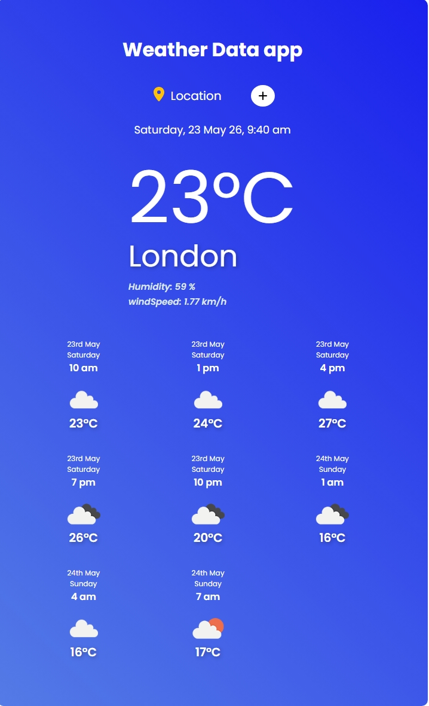
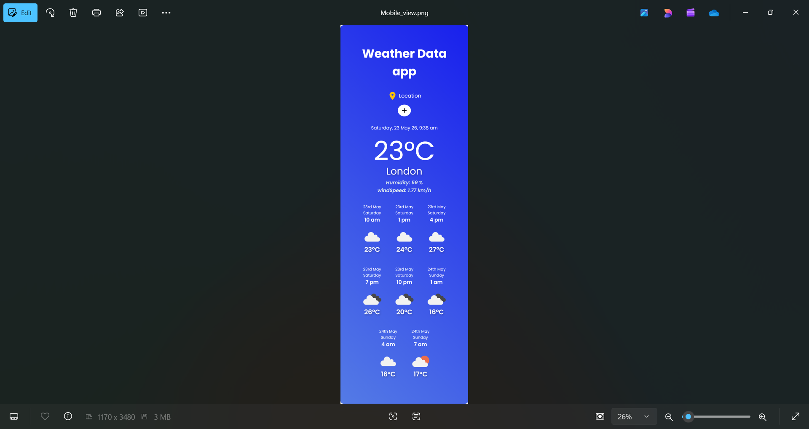

# React Weather App 🌤️

## Description
A modern React.js weather application built with Vite that fetches real-time weather data and displays current weather conditions along with a 5-day weather forecast.

---

## Screenshots

### Desktop View


### Mobile View


---

## Features

- Real-time weather data
- 5-day weather forecast
- Search weather by city
- Temperature display (°C / °F)
- Weather conditions with icons
- Humidity and wind information
- Fast performance using Vite
- Responsive UI design

---

## Tech Stack

- React.js
- Vite
- JavaScript (ES6+)
- CSS3
- Weather API

---

## Testing

Jest testing has been implemented to ensure component reliability and application stability.

---

## Installation

```bash
git clone https://github.com/your-username/react-weather-app-repo.git
cd react-weather-app-repo
npm install
